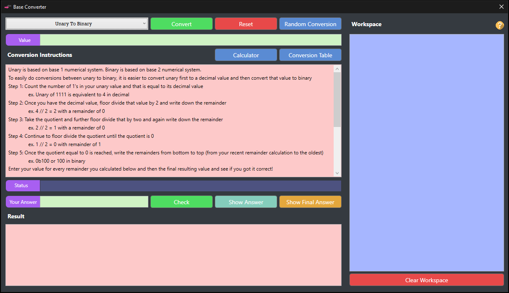
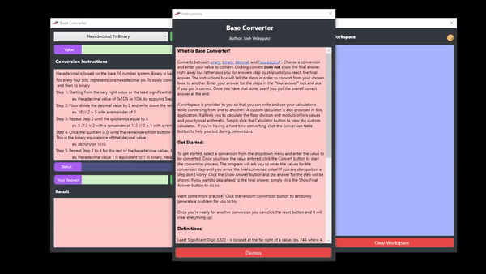
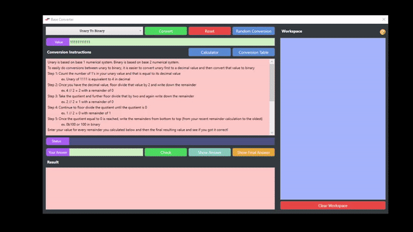

# BaseConverter
Converts the following bases, unary, binary, decimal, hexadecimal, with instructions on how to.
It can also act as a stand alone converter. It includes the conversion table for the bases and it also has a custom calculator for calculating modulo and floor division which is often used in conversions.

When the program is opened, you are greeted with an information box which contains instructions on how to use the tool and tips.

After dismissing the window, you can then choose any conversion you want. 

You can also practice your conversion skills by solving random conversions. You can also do your work in the workspace provided for ease of use.

You can also use the custom calculator that is built in the application. It allows you to do your usual arithmetic and also do modulo and floor division calculations. 

## Running the program
There is a sample release build in the SampleBuild folder.
Click the BaseConverter.exe to run the program.

## Platform
Windows
.NET Framework 4.7.2